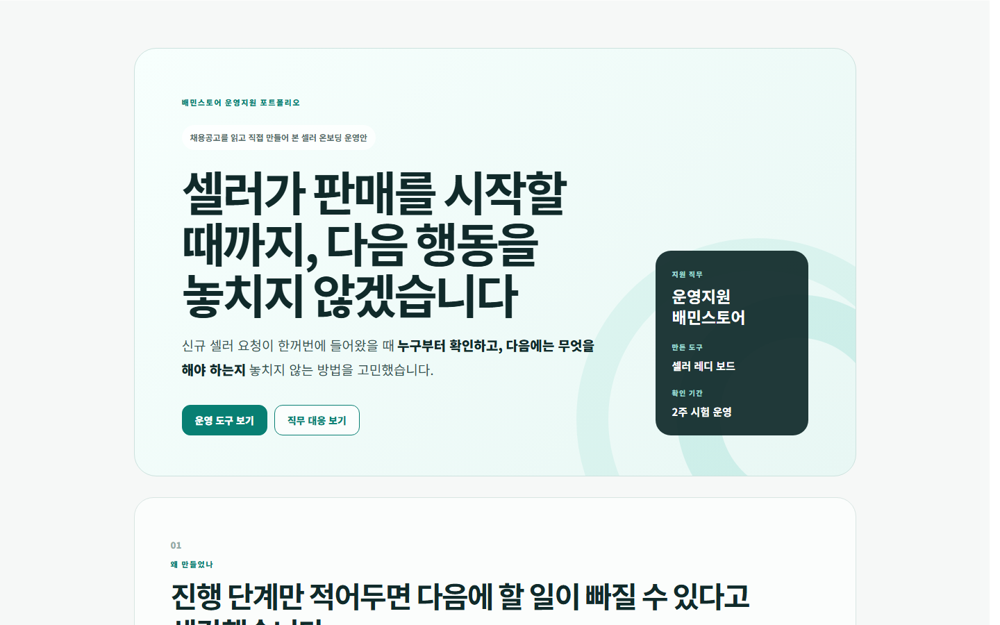

# 셀러 레디 보드

신규 판매자의 입점 준비에서 먼저 볼 문제를 고르고, 다음 행동과 완료 근거까지 남기는 운영 보드입니다.

[포트폴리오 PDF](SELLER-READY-BOARD-PORTFOLIO.pdf) | [Excel 운영표](SELLER-READY-BOARD-OPERATIONS.xlsx) | [웹 화면 파일](BAEMIN-STORE-OPERATIONS-PORTFOLIO.html)

## 소개

배민스토어 운영지원 공고와 공식 가이드를 읽으며, 상품을 등록하는 것과 실제 주문을 받을 준비가 되는 것은 다를 수 있다고 생각했습니다. 요청을 접수 순서대로 처리하면 정보 오류, 반복 문의, 임박한 오픈 일정과 담당자 누락을 놓칠 수 있습니다.

그래서 완료 기준을 **실제로 주문을 받을 준비가 된 상태**로 정하고, 왜 먼저 봐야 하는지와 담당자가 할 다음 행동을 함께 보여주는 보드를 만들었습니다. 공개 자료와 가상 사례로 만든 개인 프로젝트이며 실제 배민 내부 운영 자료는 사용하지 않았습니다.

## 목차

- [먼저 볼 신호](#먼저-볼-신호)
- [결과물 읽는 순서](#결과물-읽는-순서)
- [자료와 검증 범위](#자료와-검증-범위)
- [직접 확인하고 계산하기](#직접-확인하고-계산하기)
- [문서 안내](#문서-안내)

## 먼저 볼 신호

| 우선순위 | 확인할 문제 | 다음 판단 |
|---|---|---|
| 1. 정보 오류 | 상품과 운영 정보가 정확한가 | 잘못된 정보가 판매에 영향을 주기 전에 확인합니다. |
| 2. 장기 대기와 재문의 | 같은 문제로 오래 기다리거나 다시 문의하는가 | 이전 안내와 남은 조치를 함께 확인합니다. |
| 3. 오픈 임박 | 판매 시작 전에 필요한 준비가 끝나는가 | 시작일에 맞춰 마칠 일과 담당자를 정합니다. |
| 4. 담당자 미배정 | 다음 행동의 책임자와 기한이 있는가 | 인계할 사람, 기대하는 답과 확인 시점을 남깁니다. |

단순히 빠르게 닫은 업무 수를 늘리기보다 처리 속도, 정보 정확성과 누락을 함께 보도록 설계했습니다. 실제 팀에 적용할 때는 기준값과 처리 여력을 먼저 맞춰야 합니다.



## 결과물 읽는 순서

1. **PDF**에서 문제를 선택한 이유와 대표 사례의 판단 과정을 읽습니다.
2. **Excel**에서 대기일, 재문의, 오픈일과 담당자를 바꾸고 우선 신호가 달라지는지 확인합니다.
3. **웹 화면**에서 판매자를 선택해 위험 신호, 다음 행동과 완료 기준을 살펴봅니다.
4. **계산 노트북**에서 별도 가상 자료의 정책 비교를 다시 실행합니다.

PDF와 Excel은 같은 운영 판단을 설명하고, 계산 노트북은 더 큰 가상 표본으로 계산 과정을 확인하는 역할입니다.

## 자료와 검증 범위

| 자료 | 규모와 용도 | 확인한 범위 |
|---|---|---|
| PDF와 Excel | 가상 사례 12건 | 동일한 사례에 같은 우선 신호와 완료 기준 적용 |
| 계산용 자료 | 가상 판매자 240곳의 문의, 단계와 업무 기록 | 처리 정책 3개 재계산과 저장된 결과 일치 |
| 자동 검사 | 원자료 생성과 계산 검사 5개 | 공개 CSV 재생성, 작은 수작업 사례, 빈 입력과 잘못된 입력 처리 |

정책 비교는 56일 동안 하루 80시간의 가상 처리 여력을 동일하게 적용합니다. ‘3일 내 처리율’의 분모는 **완료한 업무**이며 미완료 업무는 별도로 셉니다. 재문의 수는 전체 기간의 가상 집계값으로, 실제 판단 시점의 정보만 사용한 운영 실험은 아닙니다.

실제 팀에서 처리시간이나 재문의가 줄었는지는 아직 측정하지 않았습니다. [2주 운영 시험](docs/operations-runbook.md)에서는 장기 대기, 정보 오류와 기록 부담을 함께 확인하도록 계획했습니다.

## 직접 확인하고 계산하기

PDF와 Excel은 위 링크에서 내려받아 열 수 있습니다. 웹 화면은 저장소를 내려받은 뒤 `BAEMIN-STORE-OPERATIONS-PORTFOLIO.html`을 브라우저로 엽니다.

계산은 Python 3.12에서 저장소 최상위 폴더의 터미널에 입력합니다.

```sh
python -m pip install -r requirements.txt
python scripts/check_repository.py
python -m unittest discover -s tests -v
python scripts/check_notebook.py
```

노트북은 공개 CSV에서 정책별 결과를 재계산합니다. 원자료 생성 명령과 출력 폴더 보존 규칙은 [재현 안내](docs/REPRODUCE.md)에 있습니다.

## 문서 안내

| 목적 | 자료 |
|---|---|
| 문제와 요구사항, 공식 출처 | [제품 기획서](docs/PRD.md) |
| 일일 운영과 부서 간 인계 | [운영 문서](docs/operations-runbook.md) |
| 판매자에게 설명하는 방식 | [안내문 초안](docs/seller-onboarding-guide.md) |
| 계산과 데이터 정의 | [분석 노트북](analysis/seller-onboarding-analysis.ipynb), [원자료](data/), [데이터 항목 설명](docs/data-dictionary.md) |

이 프로젝트에서 직접 정한 것은 우선순위의 이유, 판매자에게 설명할 내용, 다른 부서에 물을 질문과 완료 기준입니다. 가상 수치를 실제 운영 성과로 제시하지 않습니다.
